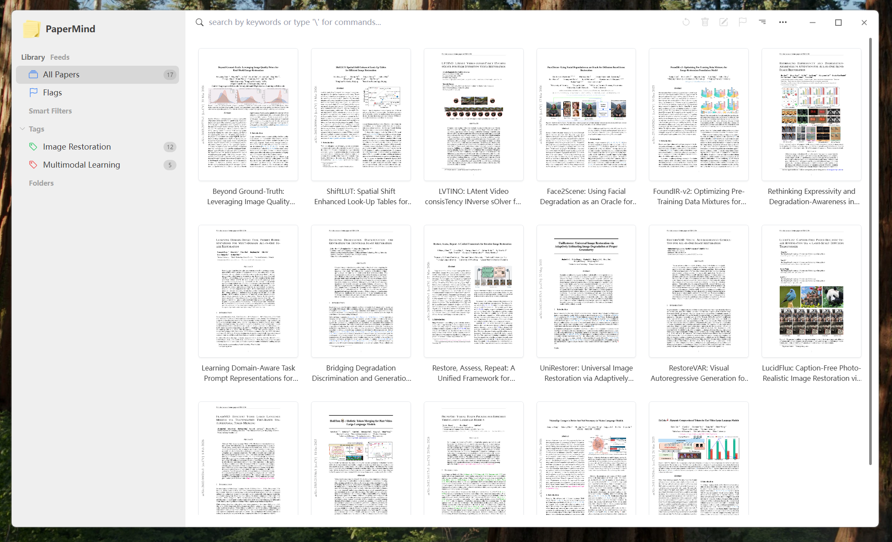
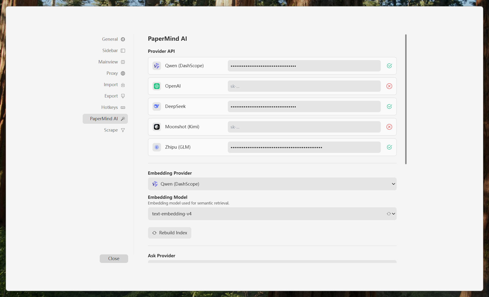
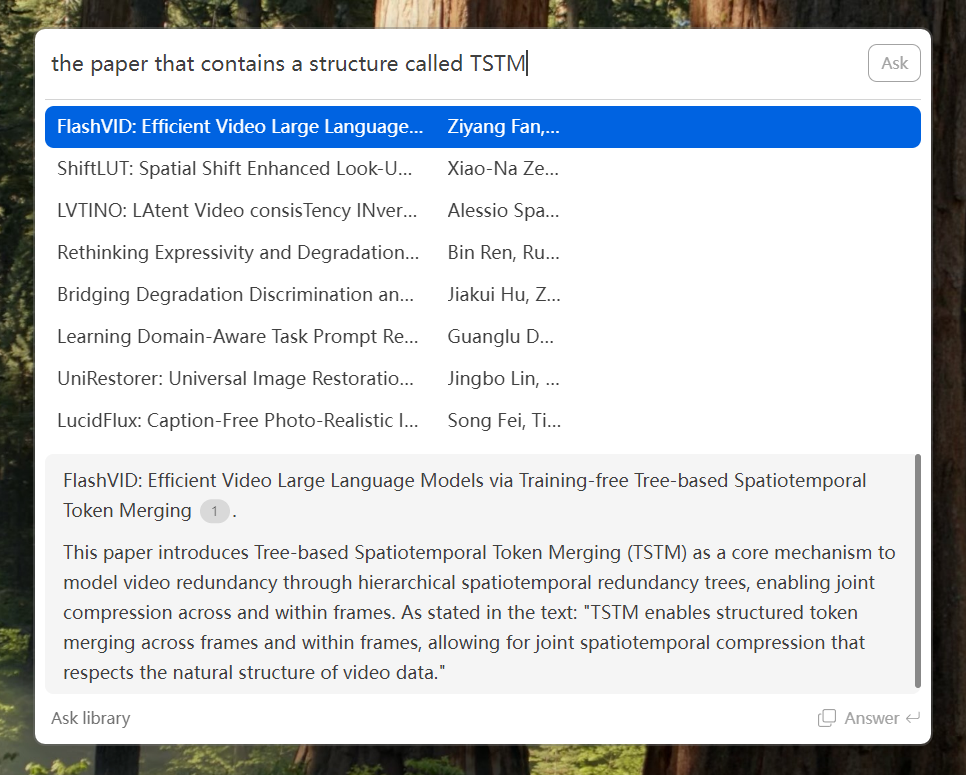
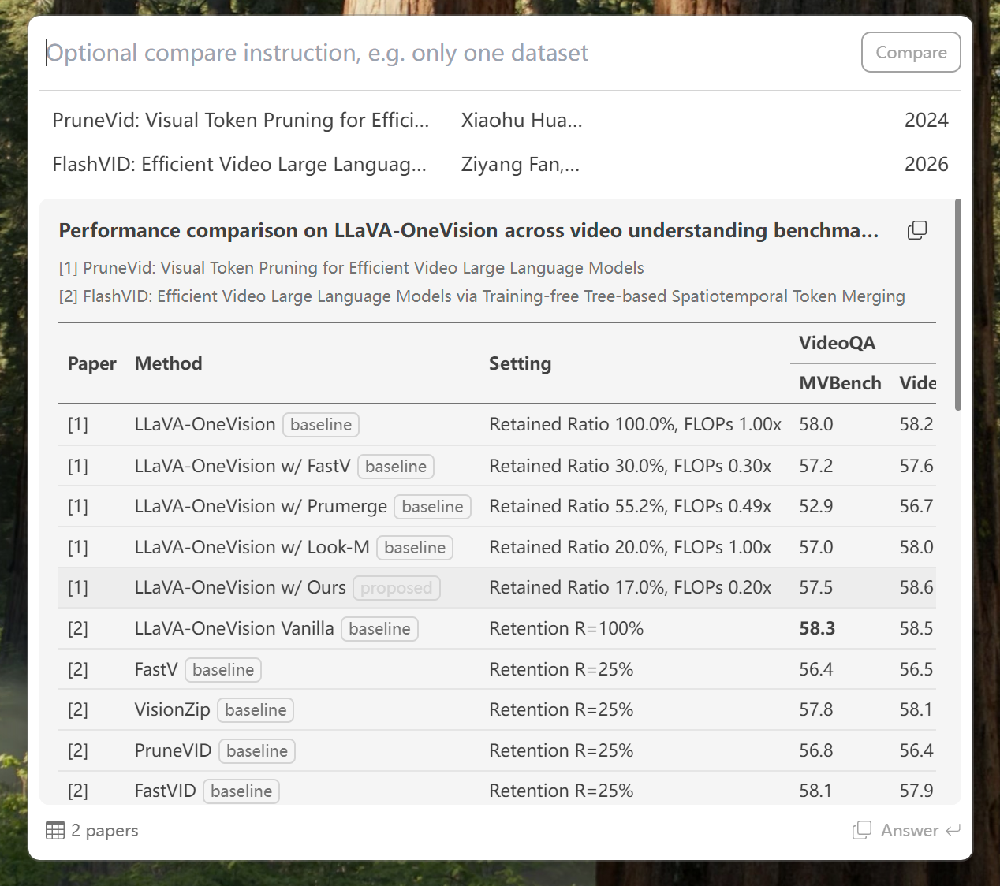



  
   
  <h2>PaperMind</h2>

<strong>An academic paper management fork built around Ask, RAG, and evidence-grounded research workflows.</strong>
 
From paper collection to semantic retrieval, citation tracing, and source-backed answering.
 
 

## Project Positioning

This repository is a **fork based on Paperlib**.

PaperMind extends Paperlib into a more research-oriented paper management tool, with a stronger focus on **Ask + RAG workflows**, **local semantic retrieval**, and **evidence-grounded citation interaction**.

I am an undergraduate student who uses Paperlib heavily in daily research reading and writing. Based on that workflow, I added a set of features aimed at making paper questioning, answer verification, and source backtracking faster, more reliable, and more natural.

## What I Added

- Embedding-based local vector database and semantic retrieval workflow powered by **PGlite + pgvector**.
- Ask-mode citation source markers in generated answers.
- Hoverable citation markers for viewing citation-specific evidence excerpts.
- Improved evidence mapping chain to reduce repeated, weak, or irrelevant quote reuse.
- Full-text chunked embedding with pooled document vectors for better long-paper semantic coverage.
- Query-aware evidence excerpt assembly for Ask answers, improving metric/value retrieval (for example PSNR/SSIM) from full paper context.
- **Experiment Compare** for selected papers: extract full-text experiment tables, align shared datasets and metrics, and compare proposed methods against their baselines.
- Quickpaste Compare mode with paper-style comparison tables, retained paper context, and LaTeX table export.
- Double-click citation markers to open the corresponding source PDF directly.
- One-click answer copy with success-check interaction.
- Quickpaste Ask layout, height, and footer interaction refinements.

## Screenshots

  

  

## Research Workflows

PaperMind is designed for the parts of reading that usually spill across tabs, notes, and spreadsheets.

- **Ask mode** helps turn a local library into a source-backed research assistant: it retrieves relevant papers, answers with citations, and keeps each claim close to the original PDF evidence.

  

    
  

- **Experiment Compare** is for reading related papers side by side. Select several papers, open Compare, and PaperMind can assemble a paper-style table across shared datasets, metrics, proposed methods, baselines, and experimental settings. The result can also be copied as a fuller LaTeX table snippet for notes or drafts.

  

    
  

## Why This Fork

In my own research workflow, I often need to read papers, ask follow-up questions with local context, and quickly verify whether an answer is actually grounded in the original source.

PaperMind is built for that exact loop:

**collect papers → ask with context → inspect evidence → jump back to source → continue reading and writing.**

The goal is not only to make paper management more convenient, but also to make AI-assisted reading more accountable by keeping answers connected to their supporting evidence.

## Quick Start

- Build and run:

  - `pnpm install`
  - `pnpm dev`

- Production build examples:
  - `pnpm build-win`
  - `pnpm build-mac-arm`
  - `pnpm build-linux`

## Acknowledgement

Core architecture and many foundational features come from the original **Paperlib** project by Future-Scholars and contributors.

This fork stands on top of their excellent work and extends it toward a more evidence-aware, RAG-centered academic reading workflow.

## License

This fork remains under **GPL-3.0** because it is based on GPL-licensed upstream code.

See [LICENSE](./LICENSE).
